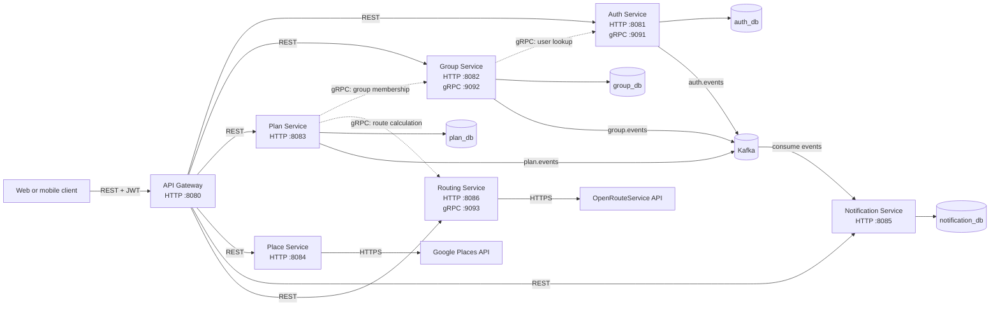
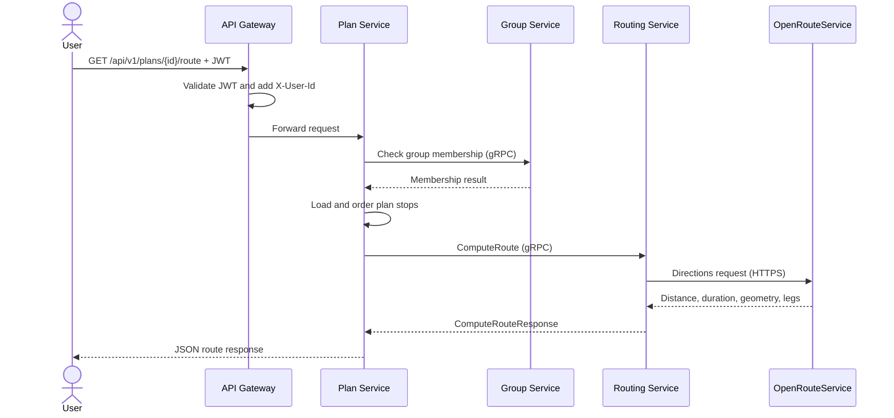

# Starlyvia

Starlyvia is a Java 25 and Spring Boot 4.1 microservice backend for collaborative trip planning. It provides authentication, groups, plans and stops, place search, route calculation, and event-driven notifications behind a single API gateway.

## Current status

The repository is in good shape for local development:

- All seven application modules compile and their test suites pass.
- Docker Compose configuration is valid and every application image builds.
- JWT authentication is enforced at the API gateway.
- Internal synchronous calls use gRPC.
- Domain events use Kafka, with retry and dead-letter handling in the notification consumer.
- PostgreSQL data is separated by service.

It is not production-ready yet. See [Known limitations](#known-limitations) for the remaining security, reliability, observability, and test-coverage work.

## System architecture



### Plan route flow



## Services

| Service | Responsibility | HTTP | gRPC | Storage and dependencies |
| --- | --- | ---: | ---: | --- |
| `api-gateway` | Routing, CORS, JWT validation, identity headers | `8080` | — | Calls all HTTP services |
| `auth-service` | Registration, login, JWT issuance, user lookup | `8081` | `9091` | `auth_db`, Kafka |
| `group-service` | Groups, members, and invitations | `8082` | `9092` | `group_db`, Auth gRPC, Kafka |
| `plan-service` | Plans, ordered stops, access control, route orchestration | `8083` | — | `plan_db`, Group gRPC, Routing gRPC, Kafka |
| `place-service` | Autocomplete, place details, nearby search | `8084` | — | Google Places API |
| `notification-service` | Notification inbox and domain-event consumers | `8085` | — | `notification_db`, Kafka |
| `routing-service` | Distance, duration, geometry, and route legs | `8086` | `9093` | OpenRouteService API |

Infrastructure exposed by Docker Compose:

| Component | Host port |
| --- | ---: |
| Kafka | `9094` |
| Auth PostgreSQL | `5433` |
| Group PostgreSQL | `5434` |
| Plan PostgreSQL | `5435` |
| Notification PostgreSQL | `5436` |

## Communication model

### External REST API

Clients call `http://localhost:8080`. Registration and login are public; all other `/api/v1/**` routes require `Authorization: Bearer <token>`.

After validation, the gateway forwards these identity headers to downstream services:

- `X-User-Id`
- `X-User-Email`
- `X-User-Role`

### Internal gRPC

| Caller | Server | Purpose |
| --- | --- | --- |
| `group-service` | `auth-service:9091` | Validate and retrieve users |
| `plan-service` | `group-service:9092` | Check membership and retrieve member IDs |
| `plan-service` | `routing-service:9093` | Calculate a route for ordered plan stops |

The `.proto` contracts are currently copied into both the client and server modules. Changes to a contract must be applied to both copies.

### Kafka events

| Topic | Producer | Consumer | Main event types |
| --- | --- | --- | --- |
| `auth.events` | `auth-service` | `notification-service` | `user.registered` |
| `group.events` | `group-service` | `notification-service` | `group.invitation.created`, `group.member.added`, `group.member.removed` |
| `plan.events` | `plan-service` | `notification-service` | `plan.created`, `plan.updated`, `plan.deleted` |

Failed notification-consumer records are retried and then published to `<source-topic>.DLT`.

## Technology stack

- Java 25
- Spring Boot 4.1
- Spring Cloud Gateway
- Spring Security and JWT
- Spring Data JPA and PostgreSQL 16
- gRPC and Protocol Buffers
- Apache Kafka
- Google Places API
- OpenRouteService Directions API
- Docker Compose
- Maven Wrapper
- JUnit 5, Mockito, H2, and Spring test support

## Project structure

```text
.
|-- api-gateway/
|-- auth-service/
|-- group-service/
|-- plan-service/
|-- place-service/
|-- notification-service/
|-- routing-service/
|-- docker-compose.yml
`-- README.md
```

Each application module owns its source code, Maven build, Dockerfile, configuration, and tests.

## Prerequisites

- JDK 25
- Docker Engine with Docker Compose
- Bash-compatible shell
- Google Places API key for place lookups
- OpenRouteService API key for route calculation

A system Maven installation is optional because every module includes Maven Wrapper.

## Quick start with Docker Compose

Set the external provider keys in your shell:

```bash
export GOOGLE_PLACES_API_KEY=your-google-places-api-key
export OPENROUTESERVICE_API_KEY=your-openrouteservice-api-key
```

Build and start the full stack:

```bash
docker compose up --build -d
```

Inspect containers and logs:

```bash
docker compose ps
docker compose logs -f api-gateway
```

Stop the stack:

```bash
docker compose down
```

Remove databases and Kafka volumes as well:

```bash
docker compose down -v
```

## Running locally

Start the infrastructure first:

```bash
docker compose up -d kafka auth-postgres group-postgres plan-postgres notification-postgres
```

Then run each application in a separate terminal:

```bash
cd auth-service && ./mvnw spring-boot:run
cd group-service && ./mvnw spring-boot:run
cd routing-service && OPENROUTESERVICE_API_KEY=your-openrouteservice-api-key ./mvnw spring-boot:run
cd plan-service && ./mvnw spring-boot:run
cd place-service && GOOGLE_PLACES_API_KEY=your-google-places-api-key ./mvnw spring-boot:run
cd notification-service && ./mvnw spring-boot:run
cd api-gateway && ./mvnw spring-boot:run
```

The default local database credentials are `starlyvia` / `starlyvia`. They are development credentials only.

## API overview

All examples use the gateway at `http://localhost:8080`.

### Authentication

Register:

```bash
curl -X POST http://localhost:8080/api/v1/auth/register \
  -H "Content-Type: application/json" \
  -d '{
    "email": "user@example.com",
    "password": "password123",
    "username": "starlyvia_user"
  }'
```

Login:

```bash
curl -X POST http://localhost:8080/api/v1/auth/login \
  -H "Content-Type: application/json" \
  -d '{"email":"user@example.com","password":"password123"}'
```

Use the returned token in the following requests.

### Groups

```bash
curl -X POST http://localhost:8080/api/v1/groups \
  -H "Authorization: Bearer <token>" \
  -H "Content-Type: application/json" \
  -d '{"name":"Weekend trip","description":"Two days away","type":"FRIENDS"}'
```

Group endpoints also support listing groups and members, sending invitations, accepting or rejecting invitations, and removing members.

### Plans and stops

Create a plan:

```bash
curl -X POST http://localhost:8080/api/v1/plans \
  -H "Authorization: Bearer <token>" \
  -H "Content-Type: application/json" \
  -d '{
    "planName": "Saigon day trip",
    "planDescription": "Food and museums",
    "planStartDate": "2026-07-20",
    "planEndDate": "2026-07-20",
    "planStartTime": "08:00:00",
    "planEndTime": "20:00:00",
    "groupId": null,
    "status": "DRAFT",
    "stops": []
  }'
```

Calculate the route of an existing plan's ordered stops:

```bash
curl "http://localhost:8080/api/v1/plans/<plan-id>/route?travelMode=DRIVE" \
  -H "Authorization: Bearer <token>"
```

Supported route modes are `DRIVE`, `WALK`, and `BICYCLE`. A route requires at least two stops with valid coordinates.

### Places

```bash
curl "http://localhost:8080/api/v1/places/autocomplete?query=cafe&lat=10.7769&lng=106.7009&sessionToken=<uuid>" \
  -H "Authorization: Bearer <token>"
```

The service also exposes `/details` and `/nearby` endpoints.

### Direct route calculation

```bash
curl -X POST http://localhost:8080/api/v1/routes/compute \
  -H "Authorization: Bearer <token>" \
  -H "Content-Type: application/json" \
  -d '{
    "travelMode": "DRIVE",
    "stops": [
      {"latitude": 10.7769, "longitude": 106.7009},
      {"latitude": 10.7825, "longitude": 106.6958}
    ]
  }'
```

### Notifications

```bash
curl "http://localhost:8080/api/v1/notifications?page=0&size=20" \
  -H "Authorization: Bearer <token>"
```

Notification endpoints also support unread count, get by ID, mark one or all as read, and delete.

## Swagger UI

The current OpenAPI UI documents the authentication service only:

```text
http://localhost:8080/swagger-ui.html
```

## Configuration

Important environment variables:

| Variable | Used by | Purpose |
| --- | --- | --- |
| `JWT_SECRET` | Gateway, Auth | JWT signing and validation secret |
| `GOOGLE_PLACES_API_KEY` | Place | Google Places authentication |
| `OPENROUTESERVICE_API_KEY` | Routing | OpenRouteService authentication |
| `OPENROUTESERVICE_BASE_URL` | Routing | Override the routing provider URL for tests or self-hosting |
| `SPRING_KAFKA_BOOTSTRAP_SERVERS` | Auth, Group, Plan, Notification | Kafka broker addresses |
| `AUTH_GRPC_HOST`, `AUTH_GRPC_PORT` | Group | Auth gRPC endpoint |
| `GROUP_GRPC_HOST`, `GROUP_GRPC_PORT` | Plan | Group gRPC endpoint |
| `ROUTING_GRPC_HOST`, `ROUTING_GRPC_PORT` | Plan | Routing gRPC endpoint |
| `GRPC_SERVER_PORT` | Auth, Group, Routing | gRPC listen port |
| `APP_KAFKA_ENABLED` | Event producers and consumers | Enable or disable Kafka integration |

Without the required external API key, the place or route lookup endpoint returns `503` when running through Docker Compose.

## Testing and build

Run a module's tests:

```bash
cd plan-service
./mvnw test
```

Run every test suite from the repository root:

```bash
for service in api-gateway auth-service group-service plan-service place-service notification-service routing-service; do
  (cd "$service" && ./mvnw test) || exit 1
done
```

Latest local verification:

| Module | Passing tests |
| --- | ---: |
| `api-gateway` | 6 |
| `auth-service` | 2 |
| `group-service` | 6 |
| `plan-service` | 5 |
| `place-service` | 1 |
| `notification-service` | 7 |
| `routing-service` | 6 |
| **Total** | **33** |

Build all Docker images:

```bash
docker compose build
```

## Known limitations

- The current Docker Compose setup is intended for development and exposes service and database ports to the host.
- Downstream services trust gateway identity headers. Production deployment must prevent clients from bypassing the gateway and spoofing those headers.
- JWT secrets and database credentials in the repository are development defaults and must be replaced in deployed environments.
- External provider keys must only come from environment variables or a secrets manager. Do not commit fallback keys to configuration files.
- Internal gRPC connections currently use plaintext and do not use service-to-service authentication.
- Database schemas use Hibernate `ddl-auto=update`; production should use versioned migrations such as Flyway or Liquibase.
- Kafka publishing is not transactional with database writes. A transactional outbox is recommended for reliable event delivery.
- Application health checks, distributed tracing, metrics dashboards, centralized logs, and resilience policies are still missing.
- Test depth is uneven. Place, provider failure paths, Kafka integration, gateway-to-service integration, and full-stack end-to-end flows need broader coverage.
- Protobuf contracts are duplicated between modules instead of being published as shared versioned artifacts.
