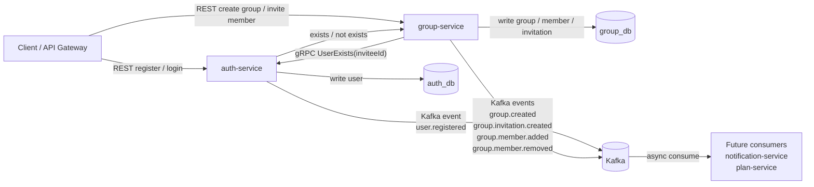

# gRPC and Kafka Flow

## Rule of Thumb

- gRPC is for synchronous service-to-service checks that need an immediate answer.
- Kafka is for asynchronous domain events that other services can react to later.
